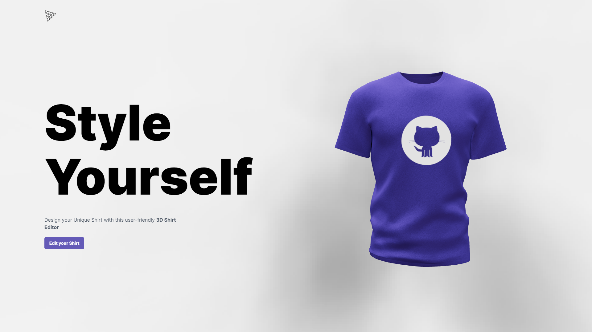

<div align="center">
<h1>Shirclex</h1>
<!-- <h3> This Project is made as a Starting Point of Learning React along side various Packages and Frameworks and will not be implemented in any Commercial Use</h3> -->
<p align= "center">
	
</p>
</div>


&nbsp;

## Acknowledgments
- [Video](https://www.youtube.com/watch?v=ZqEa8fTxypQ)
- [Instructor](https://www.jsmastery.pro/)

&nbsp;


## Technologies Used:
- [React Three Fiber](https://docs.pmnd.rs/react-three-fiber/getting-started/introduction)
- [Vite](https://vitejs.dev/)
- [Framer Motion](https://www.framer.com/motion/)
- [Tailwind](https://tailwindcss.com/)
- [ThreeJS](https://threejs.org/)

&nbsp;
## To Clone and Host Locally
```bash
git clone https://github.com/arunabh-a/Shirclex.git
```

Go to the project directory

```bash
cd Shirclex
```

Install dependencies

```bash
npm install
```

Start the server

```bash
npm run dev
```

